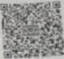

统一社会信用代码

92440300MA5FPG0XXH

# 营业执照

# （副本）

名

称

深圳市宝安区西乡街道韩薛炸鸡汉堡店

类 型 个体工商户

成立日期 2019年07月12日

经营者薛丁川

经营场所

深圳市宝安区西乡街道围攻社区迪福路1号佛商大厦027

1. 商事主体的经营范围由章程确定，经营范围中属于法律、法规规定应当经批准的项目，取得许可审批文件后方可开展相关经营活动。

2. 商事主体经营范围和许可审批项目等有关企业信用事项及年报信息和其他信用信息，请登录左下角的国家企业信用信息公示系统或扫描右上方的二维码查询。

3. 各类商事主体每年须于成立周年之日起两个月内，向商事登记机关提交上一自然年度的年度报告。企业应当按照《企业信息公示暂行条例》第十条的规定向社会公示企业信息。

登记机关

2019年07月12日