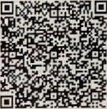
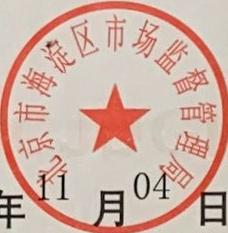

统一社会信用代码

91110108306767909G

# 营业执照

扫描二维码登录“国家企业信用信息公示系统”了解更多登记、备案、许可、监管信息

名称 北京索伯尼国际科技有限公司

注册资本2000万元

类型有限责任公司（自然人独资）

成立日期2014年08月25日

法定代表人 刘福喜

营业期限2014年08月25日至2034年08月24日

经营范围技术开发、技术推广、技术转让、技术咨询、技术服务；软件开发；数据处理；基础软件服务；应用软件服务；软件咨询；计算机系统服务；零售文化用品、计算机、软件及辅助设备、电子产品、器件和元件、机械设备、通讯设备、五金交电、自行开发后的产品。（企业依法自主选择经营项目，开展经营活动；依法须经批准的项目，经相关部门批准后依批准的内容开展经营活动；不得从事本市产业政策禁止和限制类项目的经营活动。）

住所：北京市海淀区中关村大街49号9号楼B座四层405室

登记机关

2019年11月04日